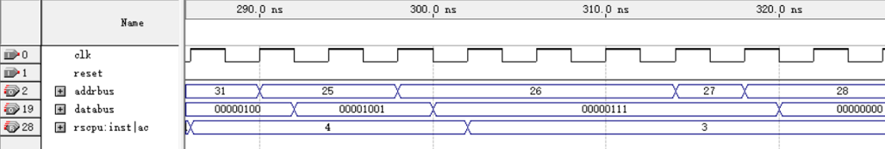

# 实验报告

## 实验名称（相对简单CPU电路设计）

* 班级:智能1602
* 学号:201608010624
* 姓名:牟清华

## 实验目标

利用VHDL设计相对简单CPU的电路并验证。

## 实验要求

* 采用VHDL描述电路及其测试平台
* 采用时序逻辑设计电路
* 采用从1累加到n的程序进行测试

## 实验内容

### 相对简单CPU的设计需求

相对简单CPU的设计需求请详见课件，主要特征如下：

* 地址总线16位，数据总线8位
* 有一个8位累加寄存器AC，一个8位通用寄存器R，一个1位的零标志
* 有一个16位AR寄存器，一个16位程序计数器PC，一个8位数据寄存器DR，一个8位指令寄存器IR，一个8位临时寄存器TR
* 有16条指令，每条指令1个或3个字节，其中操作码8位。3字节的指令有16位的地址

### 相对简单CPU设计方案

相对简单CPU的设计方案请详见课件，主要思路如下：

1. 指令执行过程分为取指、译码、执行三个阶段
1. 取指包括三个状态，FETCH1，FETCH2,FETCH3
2. 译码体现为从FETCH3状态到各指令执行状态序列的第一个状态
3. 执行根据指令的具体操作分为若干状态
4. 执行的最后一个状态转移到FETCH1状态
5. 控制器根据每个状态需要完成的操作产生相应的控制信号

## 测试

### 测试平台

相对简单CPU电路在如下机器上进行了测试：

| 部件     | 配置             | 备注   |
| :--------|:----------------:| :-----:|
| CPU      | core i5-6500U    |        |
| 内存     | DDR3 8GB         |        |
| 操作系统 | windows 10       | 专业版 |
| 综合软件 | quatus ii9.1     |        |
| 仿真软件 | quatus ii9.1     |        |
| 波形查看 | quatus ii9.1     |        |

### 测试输入

我们采用从1累加到n的程序作为测试输入：

### 测试记录

相对简单CPU运行测试程序的地址总线、数据总线、AC累加器等信号波形截图如下：

第一条指令RSCLAC和第二条指令RSSTAC运行后各个信号的输出

第三条指令RSSTAC运行后各个信号的输出

第四条指令RSLDAC运行后各个信号的输出

第五条指令RSINAC和第六条指令RSSTAC运行后各个信号的输出

第七条指令RSMVAC和第八条指令RSLDAC运行后各个信号的输出

第九条指令RSADD和第十条指令RSSTAC运行后各个信号的输出

第十一条指令RSLDAC运行后各个信号的输出

第十二条指令RSSUB和第十三条指令RSJPNZ运行后各个信号的输出

最后指令完成运行后各个信号的输出

## 分析和结论

从测试记录来看，相对简单CPU实现了对测试程序指令的读取、译码和执行，得到的运算结果正确。

根据分析结果，可以认为所设计的相对简单CPU实现了所要求的功能，完成了实验目标。

