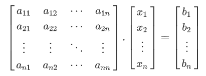
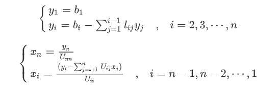
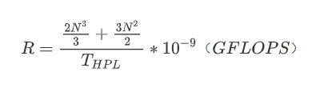
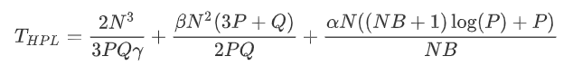
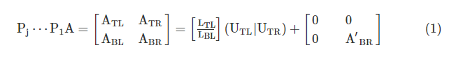
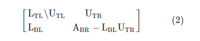
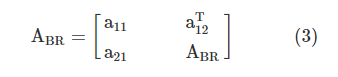
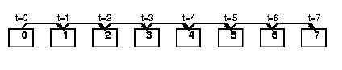
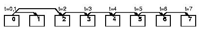
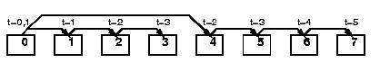

# **Linpack分析**

## 目录

### 	**1.[Linpack介绍](#Linpack介绍)**

### 	**2.[HPL测试原理](#HPL测试原理)**

### 	**3.[HPL算法描述](#HPL算法描述)**

### 	**4.[HPL代码分析](#HPL代码分析)**


---

# **Linpack介绍**

 **Linpack**现在在国际上已经成为最流行的用于测试高性能计算机系统浮点性能的基准。通过利用高性能计算机，用高斯消元法求解N元一次稠密线性代数方程组的测试，评价高性能计算机的浮点性能。  

 衡量计算机性能的一个重要指标就是**计算峰值**，例如浮点计算峰值，它是指计算机每秒钟能完成的浮点计算最大次数。包括理论浮点峰值和实测浮点峰值。**理论浮点峰值**是该计算机理论上能达到的每秒钟能完成浮点计算最大次数，它主要是由CPU的主频决定的。实测浮点峰值是指Linpack测试值。

 **Linpack测试包括三类：**

#### 	Linpack100：

 其求解规模为100阶的稠密线性代数方程组，它只允许采用编译优化选项进行优化，不得更改代码，甚至代码中的注释也不得修改。 

#### 	Linpack1000：

 其要求求解规模为1000阶的线性代数方程组， 达到指定的精度要求，可以在不改变计算量的前提下做算法和代码上做优化。 

#### 	HPL:

 HPL即High Performance Linpack，也叫高度并行计算基准测试。 它对数组大小N没有限制，求解问题的规模可以改变，除基本算法（计算量）不可改变外，可以采用其它任何优化方法。 

 随着现代计算机的快速发展，前面两种测试方式也就是越来越不被重用了，由于HPL对数组大小没有限制，所以现代的并行计算机大部分是使用HPL作为测试标准。

 我也就主要对HPL测试标准进行分析。


# HPL测试原理

###  测试过程：
<span id="1"></span>

 HPL测试就是利用高斯消元法求解线性方程组，所以假设求解的问题如下：
	
 
 
 HPL是通过求解一个稠密线性方程组来测试计算机的性能，a矩阵是一个n*n的矩阵，b向量是一个n维的列向量，它们两个均是已知的，x向量也是一个n维的列向量，是要求解的。经过LU分解，就可以将求解方程组的问题转换为求解两个三角方程组。LU分解是我们在线性代数中学过的，矩阵A可以转化为LU，即A=LU，L是下三角矩阵，U是上三角矩阵。这实际上也就是通过高斯消元法来求解的，在进行高斯消元法后可以得到一个上三角矩阵，也就是U矩阵，其过程中的变换矩阵也就是L矩阵。

 由A=LU可得，即 Ax=b就可以表示为LUx=b，令y=Ux，则Ly=b就可以求得y的值，再由Ux=y，求得x的值。计算公式如下：
	
 


### 	计算速率：

 通过上述式子就可以计算出线性方程组的解，然后统计计算大规模的稠密线性方程组耗费的时间，就可以求得计算浮点的速率。计算公式如下：
 
 
 
 公式中 2N<sup>3</sup>/3+3N<sup>2</sup>/2表示的是浮点运算的规模， T<sub>HPL</sub>表示的是HPL测试程序执行的时间，也就是[测试过程](#1)中求n维列向量的时间，GFLOPS单位：每秒10亿次的浮点运算数（10<sup>9</sup>）。得到浮点速率后，与计算机的峰值相除（**计算机的峰值**是理论最大性能，是不可能达到的理想值，等于CPU主频 x CPU每个时钟周期执行浮点运算的次数 x 系统中CPU核心数目），就可以得到计算机的运行效率。


### 	执行时间：

 假设内存空间足够，不发生交换，也不考虑cache缺失，可以得到T<sub>HPL</sub>的值。计算公式如下：


 这个公式很复杂，α表示处理器之间进行一次通信的启动时间，β表示通信的速率，γ表示处理器的一个矩阵浮点运算的速率。

 但是总的来说，T<sub>HPL</sub>主要分为两个部分，一部分是BLAS函数的执行时间，对应公式中的2N<sup>3</sup>/3PQγ，另一部分是广播通信的时间，对应公式中的后面那两部分，前者主要受BLAS函数库和cache缺失率的影响，后者主要受互联网路结构、PxQ（处理器网格的排列形式）、广播算法、MPI（消息传递接口）的影响。

# HPL算法描述

### 主要算法：

 HPL中的LU分解采用分块的形式实现，大小为NB x NB，同一列上的块组成一个面板。HPL实现时先对面板内的数据进行LU分解，得到LU矩阵之后，再求出方程的解x。分解完一个面板后，这个面板的解肯定需要其他的面板（列）知道。

 如前面所述，HPL解决的是一个线性方程组求解的问题：

 

 通过对于方程式n行n+1列的系数矩阵的行基本变换进行LU因式分解，最后得到：
```
 Ly=P

 Ux=y
```
 对列主元 (即行的基等变换) LU分解算法如下：

 假设A 为m×n矩阵，L为m×n单位下三角矩阵，U为m×n上三角矩阵，P为m×m置换矩阵，P = P<sub>n-1</sub>，…，P<sub>1</sub>，P<sub>j</sub>为第j次循环完成第j行与主元行进行交换的置换矩阵。

#### 		基本算法：

 假定已得到置换矩阵P<sub>1</sub>，…，P<sub>j</sub>使得：

  

 其中A<sub>TL</sub>，L<sub>TL</sub>和U<sub>TL</sub>是j×j矩阵，原矩阵被下面的矩阵所覆盖：

  

 把式 (1) 中右下角部分矩阵仍记为A<sub>BR</sub>，下面对A<sub>BR</sub>继续进行列主元LU分解，其步骤如下：

①把A<sub>BR</sub>划分为如下形式：

A<sub>BR</sub> = (a<sub>B1</sub>|A<sub>B2</sub>)

②找到a<sub>B1</sub>中绝对值最大的元素及所在行，假设为k，得到主元和置换矩阵P<sub>j</sub>+1。

③作变换P<sub>j+1</sub>A，实际上是对 (A<sub>BL</sub>|A<sub>BR</sub>) 的第一行和主元行作变换，然后划分A<sub>BR</sub>为：

 

④作更新a<sub>21</sub>←a<sub>21</sub>a<sub>11</sub>。

⑤作更新A<sub>BR</sub>←A<sub>BR</sub>-a<sub>21</sub>a<sub>12</sub><sup>T</sup>。

⑥此时A<sub>BR</sub>为 (m-j-1) × (n-j-1) 的矩阵阶，若`min(m-j-1,n-j-1)>1`，则重复前面的步骤, 否则结束。

#### 	分块算法：

 因为一阶更新中对O(n<sup>2</sup>)个数据只能进行O(n<sup>2</sup>)个操作，算法计算通信比很低，因此并行计算的性能将很低。为了提高性能，必须采用分块的算法。

 LU分解的分块算法，只要在划分A<sub>BR</sub>时把式 (3) 中的a<sub>11</sub>用b×b的块矩阵A<sub>11</sub>代替，相应地a<sub>21</sub>和a<sub>12</sub><sup>T</sup>也用(m-j×b) x b和b x (n-j×b) 的矩阵A<sub>21</sub>和A<sub>12</sub>代替，即可得到分块LU分解算法：

①用前面的算法分解A<sub>11</sub>得到A<sub>11</sub>=L<sub>11</sub>U<sub>11</sub>，同时得到A<sub>21</sub>的更新，仍记为A<sub>21</sub>。

②解右端下三角线性代数方程组L<sub>11</sub>U<sub>11</sub>=A<sub>12</sub>，仍把U<sub>12</sub>记为A<sub>12</sub>。

③计算A<sub>BR</sub>=A<sub>BR</sub>-A<sub>21</sub>A<sub>12</sub>。

④此时A<sub>BR</sub>为 (m-j×b) x (n-j×b) 阶矩阵，若`min(m-j×b,n-j×b)>1`，则重复前面的步骤，否则结束。

上面的j和b分别是循环次数和分块大小。

#### 	广播算法

 计算完面板分解后，该列面板将广播到其他过程列。HPL中提供很多的广播算法。假设过程0是广播的来源。如下：
 
 *

 

 该算法是最经典的算法。但是广播来源的后一个进程必须发送一条消息。

 *
 
 

 该算法中，广播源必须发送两条消息，但是后一个进程只需要接收一条消息。

 *
 
 

 该广播过程分为两部分：0-> 1和0-> Q / 2；然后，过程1和Q / 2充当两个环的来源：1-> 2，Q / 2-> Q / 2 + 1；2-> 3，Q / 2 + 1->Q / 2 + 2，依此类推。Q为整个广播过程中的进程数。该算法的优势在于减少了最后一个进程接收面板的时间，但广播源发送了两条消息。
