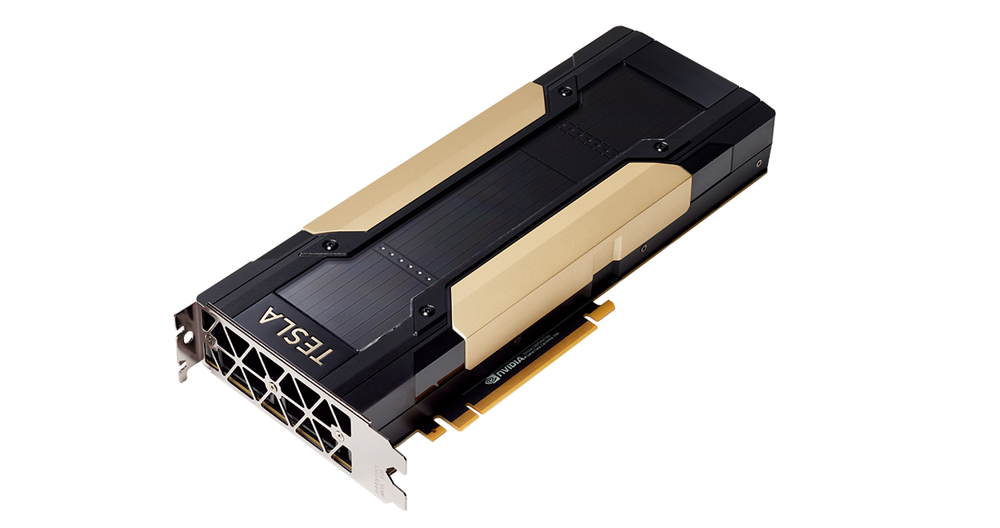
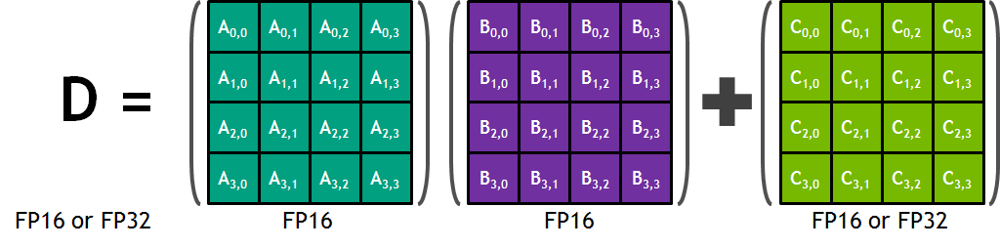

# TeslaGPU架构分析

## 目录

---

### 1.[Tesla V100 GPU架构简介](#tesla-v100-gpu架构简介)

### 2.[Tesla V100 GPU的主要特点](#tesla-v100-gpu的主要特点)

### 3.[Tesla V100 GPU的硬件架构](#tesla-v100-gpu的硬件架构)

---

### 1.Tesla V100 GPU架构简介

​	NVIDIA GPU加速了数千个高性能计算（HPC），数据中心和机器学习应用程序。 NVIDIA GPU已成为领先的计算引擎为人工智能（AI）革命提供动力。NVIDIA GPU加速了众多深度学习系统和应用程序，包括自动驾驶车载平台，高精度语音，图像和文本识别系统，智能视频分析，分子模拟，药物发现，疾病诊断，天气预报，大数据分析，财务建模，机器人技术，工厂自动化，实时语言翻译，在线
搜索优化和个性化的用户推荐等等。

​	Tesla V100 Tensor Core 是有史以来极其先进的数据中心 GPU，能加快 AI、高性能计算 (HPC) 和图形技术的发展。其采用 NVIDIA Volta 架构，并带有 16 GB 和 32GB 两种配置，在单个 GPU 中即可提供高达 100 个 CPU 的性能。如今，数据科学家、研究人员和工程师可以减少优化内存使用率的时间，从而将更多时间用于设计下一项 AI 突破性作品。 

​	下图是Tesla V100 SXM2 模块：

​	NVIDIA Tesla V100加速器是世界上性能最高的并行处理器，其设计以支持计算量最大的HPC，AI和图形工作负载。GV100 GPU包括211亿个晶体管，管芯尺寸为815 mm 2。它是在全新的台积电12纳米FFN（FinFET NVIDIA）高性能制造工艺专为英伟达GV100提供了更高的计算性能，并增加了许多新功能与之前的Pascal GPU相比。进一步简化了GPU编程，并且在应用程序移植方面，GV100还提高了GPU资源利用率。 GV100是一款功能强大的高效处理器，每瓦提供出色的性能。

​	下图是PCLE接口的NVIDIA Tesla V100：

**Tesla V100用于人工智能训练平台**

​	从语音识别到训练虚拟个人助理和教会自动驾驶汽车自动驾驶，数据科学家们正利用人工智能解决日益复杂的挑战。解决此类问题需要花大量时间密集训练复杂性飞速增长的深度学习模型。Tesla V100 拥有 640 个 Tensor 内核，是世界上第一个突破 100 万亿次 (TFLOPS) 深度学习性能障碍的 GPU。新一代 NVIDIA NVLink™ 以高达 300 GB/s 的速度连接多个 V100 GPU，在全球打造出功能极其强大的计算服务器。现在，在之前的系统中需要消耗数周计算资源的人工智能模型在几天内就可以完成训练。随着训练时间的大幅缩短，人工智能现在可以解决各类新型问题。

​	

**Tesla V100 用于人工智能推理平台**

​	为了利用最相关的信息、服务和产品加强人与人之间的联系，超大规模计算公司已经开始采用人工智能。然而，及时满足用户需求是一项困难的挑战。例如，全球最大的超大规模计算公司最近估计，如果每个用户一天仅花费三分钟时间使用其语音识别服务，他们便需要将数据中心的容量翻倍。设计Tesla V100 就是为了在现有的超大规模服务器机架上提供更高的性能。由于将人工智能作为核心，Tesla V100 GPU 可提供比 CPU 服务器高 30 倍的推理性能。这种吞吐量和效率的大幅提升将使人工智能服务的扩展变成现实。

​	

**Tesla V100 用于高性能计算（HPC）**

​	高性能计算是现代科学的基石。从天气预报到发现药物和发现新能源，研究人员使用大型计算系统来模拟和预测我们的世界。人工智能可让研究人员分析大量数据，在仅凭模拟无法完全预测真实世界的情况下快速获取见解，从而扩展了传统的高性能计算。Tesla V100 的设计能够融合人工智能和高性能计算。它为高性能计算系统提供了一个平台，在用于科学模拟的计算机科学和用于在数据中发现见解的数据科学方面表现优异。通过在一个统一架构内搭配使用 NVIDIA CUDA 内核和 Tensor 内核，配备 Tesla V100 GPU 的单台服务器可以取代数百台仅配备通用 CPU 的服务器来处理传统的高性能计算和人工智能工作负载。现在，每位研究人员和工程师都可以负担得起使用人工智能超级计算机处理最具挑战性工作的做法。

​	

### 2.Tesla V100 GPU的主要特点

 * **为深度学习设计的新的流多处理器（SM）架构**

    Volta的一个重要特征是在GPU的中心的新设计的SM的处理器结构。新的Volta SM是比上一代Pascal的设计节能50%，在相同的功率包络下，在FP32和FP64的性能有大幅提升。新的专为深度学习设计的张量核能够为训练提供高达12倍的TFLOP的峰值运算能力。有了独立、并行整数和浮点数据通路，Volta SM对于计算和寻址计算的混合工作量也更有效。Volta的新的独立线程调度能力使细粒并行线程之间的同步和合作成为可能。最后，一个新的组合了L1数据高速缓存和共享内存的子系统显着提高了性能，同时也简化了编程。 

 * **二代NVLinkTM**

    NVIDIA NVLink二代高速互连提供了更宽的带宽，更多的链接，以及提高了多GPU和多GPU / CPU系统配置的可扩展性。GV100最多可以支持6 个25Gb/s的NVLink链接，总数为300 Gb / s。NVLink现在支持CPU控制和缓存与基于IBM的Power 9处理器的服务器一致性功能。新 与V100 AI超级计算机采用NVLink为超快速深度学习训练提供更高的可扩展性。 

 *  **HBM2内存：更快，更高的效率**

    Volta高度调整的16GB HBM2内存子系统可以提供峰值达到**900 Gb/秒**的内存带宽。三星的新一代HBM2内存和Volta的新一代内存控制器的结合，与Pascal GP100相比，提供了1.5倍的交付内存带宽和运行多个工作负载时大于95%的内存带宽效率。

 * **Volta多进程服务**

    Volta多进程服务（MPS）是Volta GV100架构的一个新的功能，提供了对CUDA MPS服务器关键部件的硬件加速，能够提高性能，隔离，和多个计算应用共享GPU时更好的服务质量（QoS）。Volta MPS也将MPS最大客户数提高了三倍，从Pascal的16个 到Volta的48个。 

 * **增强的统一内存和地址翻译服务**

    VoltaGV100 内，GV100统一存储技术包括了新的访问计数器，能够允许内存页更准确的迁移到访问页面最频繁的处理器，提升了访问内存范围处理器之间的共享效率。在IBM Power平台上，新地址转换服务（ATS）支持允许GPU直接访问CPU的页表。 

 * **协作组及合作推出的新API**

    **协作组**是一种新的编程模型，在CUDA 9中首次出现，可以组织线程沟通组。协作组允许开发人员表达通信线程的粒度，帮助他们更丰富地表达，更高效的并行分解。基本协作组的功能在Kepler之后的所有的NVIDIA GPU上都支持。Pascal和Volta包括支持新的合作推出API，支持CUDA线程块之间的同步。Volta添加了新的同步模式支持。 

   > ​	在有效的并行算法中，线程通过合作并共享数据来执行集体计算。要共享数据，线程必须同步。共享的粒度因算法而异，因此线程同步应该是灵活的。要使得同步成为程序的显式部分，来确保安全、可维护和模块化。所以为了满足这些要求，就引入了协作组，它通过扩展CUDA编程模型，从而允许内核动态地组织线程组。在以前，CUDA编程模型为同步协作线程提供了一个单一的、简单的构造。
   >
   > ​	 协作组编程模型描述了 CUDA **线程块内部**和**跨线程块**的同步模式。它提供了用于定义、分区和同步线程组的 CUDA 设备代码 APIs。它还提供主机端 APIs 来启动 “所有线程都保证并发执行” 的网格，以支持线程块之间的同步。这些原语支持 CUDA 中协作并行的新模式，包括**产品-消费者并行**和**跨整个线程网格甚至多个 GPU 的全局同步**。
   >
   > **协作组编程模型**由以下元素组成：
   >
   > * 表示协作线程组及其属性的数据类型；
   > * CUDA启动API定义的内部组；
   > * 组分区操作；
   > * 组屏蔽同步操作；
   > * 特定组的集合；
   >
   > 
   >
   > ​	 线程组提供了在组中的所有线程之间执行集体操作的能力。**集合操作**，或者简单地称为集合体，是需要在指定的一组线程之间同步或以其他方式通信的操作。由于需要同步，标识为参与集体的每个线程都必须对该集体操作进行匹配调用。最简单的集合操作是一个屏障（barrier），它不传输任何数据，只同步组中的线程。所有线程组都支持同步。 
   >
   > 下面是协作组支持灵活线程组显式同步的示意图：
   >
   > 

 * **最高性能及最高的效率模式**

    在最高性能模式下， TeslaV100加速器将不受它的TDP（热设计功耗），约为300W，的约束，来加速需要最快计算速度和最高数据吞吐量的应用程序。最大效率模式允许数据中心管理人员调整他们的TeslaV100加速器电源的使用操作，在最佳的每瓦性能下进行工作。一个不超过的功率上限可以在所有的GPU上进行设置，减少功率消耗，同时依旧能获得优秀架构性能。 

下图就是Tesla V100中的一些新技术：

### 3.Tesla V100 GPU的硬件架构

​	GV100 GPU是由多个图形处理集群（GPC）、纹理处理集群（TPCS）、流多处理器（SM）、和内存控制器组成的。完整的GV100 GPU 由6个GPCs、84个Volta SM、42个TPC（每个包括2个SM）、和8个512位内存控制器（总共4096位）。每个SM 有64个 FP32核、64个INT32核、32个FP64核和8个新张量核。每个SM也包括四个纹理单元。 一个完整的GV100 GPU共有5376个FP32核、5376个INT32核，2688个FP64核、672个张量核和336个纹理单元。每个内存控制器连接到768 KB的L2高速缓存，每个HBM2DRAM堆栈由一对内存控制器控制。完整的GV100 GPU共6144KB L2高速缓存。  

下图是一个具有84个SM的完整GV100 GPU：

下面是不同种类的Tesla加速器的比较图，可以让我们更加清楚的分析Tesla V100 GPU的架构：

​	可以看出GV100 GPU新增了张量核（Tensor Cores，这个会在后面讲到），值得一提的是，GV100 GPU使用了12nm的FFN，但是芯片的面积还是达到了815mm2，其他的硬件都有所提升。

下面具体来介绍Tesla V100 GPU的硬件架构：

* **Volta SM（流多处理器）**

   Volta SM的架构是设计来提供更高的性能的，它的设计比过去的SM设计降低了指令和高速缓存的延迟，并且包括了新的功能来加速沈度学习的应用。

  主要特征包括：

  * 专为深度学习矩阵算法建造的新混合精度FP16 / FP32张量核；
  * 增强的L1数据缓存，达到更高的性能和更低的延迟 ；
  * 简单的解码和减少指令延迟的精简指令集；
  * 更高的频率和更高的功率效率；

   Volta GV100 SM包括单独的FP32和INT32核，允许在全吞吐量上同时执行FP32和INT32的操作，但同时也增加了指令问题的吞吐量。

* **Tensor Cores（张量核）**

   Tesla P100相比前代 NVIDIA Maxwell、Kepler架构能够提供相当高训练神经网络的性能，但神经网络的复杂性和规模却持续增长。有数千层和数百万神经元的新网络甚至需要更高的性能和更快的训练时间。  

  > 但是并不是所有的神经网络都有很好的加速效果，举个例子：
  >
  > RNN（循环神经网络）是处理量化金融、风险管理等时序数据的主要深度学习模型。下图展示了 RNN 中的一个神经元，它不仅是最基础的组成部分，同时还是其它更复杂循环单元的基础。从下图可以看出该神经元的输出 y 不仅取决于当前的输入 x，同时还取决于储存的前面状态 W，前面循环的状态也可以称之为反馈循环。正是这种循环，RNN 能够学习到时序相关的依赖性。 
  >
  > 

   新的张量核是VoltaGV100架构的最重要的特征，来帮助提升训练大型神经网络的性能。Tesla V100的张量核提供高达120 Tensor TFLOPS 的训练和推理应用。

   矩阵乘积（BLAS GEMM）操作是神经网络训练和推断的核心，通过它来进行网络连接层输入数据和权重的矩阵相乘。每一个张量核提供了一个4x4x4的矩阵处理阵列进行D操作。如下图，A、B、C和D是4x4的矩阵。矩阵乘法的输入A和B是FP16矩阵，而积累矩阵C和D可能FP16或FP32的矩阵。

  

   每个张量核每钟次执行64浮点FMA混合精度操作，（FP16乘法和FP32累加）和SM中的8个张量核共执行1024次浮点运算。这是一个每个SM 达到8倍提高吞吐量的深度学习应用，相比于使用标准FP32操作的Pascal GP100，导致Volta V100 GPU吞吐量总共增加12倍，相比于Pascal P100 GPU。张量内核对输入的FP16数据使用FP32累加操作。FP16经过FP32累加操作，以及给定4x4x4矩阵点积相乘的结果是一个完整的精度，如下图所示：

  

 * **Volta SIMT模块**

    Volta通过让所有线程之间并发平等来转换这幅画。它通过维护每个线程的执行状态，包括程序计数器（PC）和调用堆栈（S）来完成这一操作，而早期的结构保持每个wrap的资源，如下图所示：

   

    Volta的独立线程调度允许GPU执行任何线程，或者可以更好地利用执行资源，或者允许一个线程等待由另一个产生的数据。为了最大限度地提高并行效率，Volta包括计划优化器确定如何从同一warp组织活动的线程到SIMT单元中。这一操作与之前NVIDIA GPU相同，保留了SIMT执行的高吞吐量，但灵活性更高。因为线程现在可以发散和会聚于子warp粒度，并且Volta会仍然将执行相同代码的线程集合在一起，并且并行运行。 

    Volta独立线程调度能够从不同分支交替执行语句。这使得一个warp内的线程可以同步和通信的细粒度并行算法可以执行。 如下图：

   

   
